# Bucket A matched examples

Panel order: **original | coloured instance masks | colour-matched poses**.

A pose and its assigned mask always share the same colour. Assignment maximizes one-to-one
skeleton coverage within a 20-pixel mask dilation.

## 01 — `Stage_3/Sigmoid/3/181562`

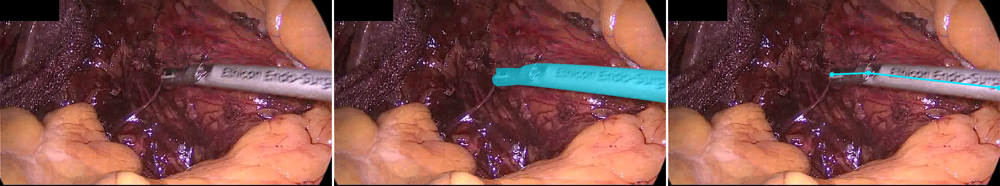

Pose-index assignment: `[50]`.

## 02 — `Training/Proctocolectomy/9/62240`

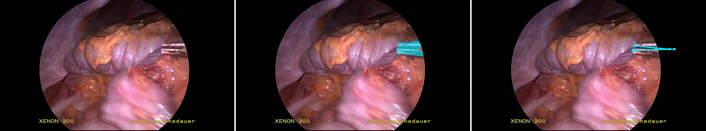

Pose-index assignment: `[50]`.

## 03 — `Training/Proctocolectomy/9/89056`

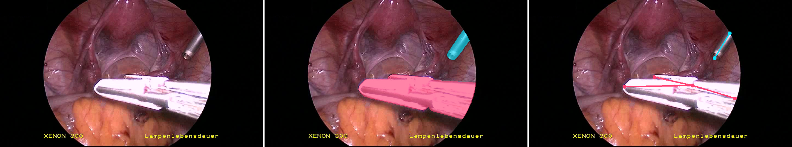

Pose-index assignment: `[100, 50]`.

## 04 — `Training/Proctocolectomy/5/27180`

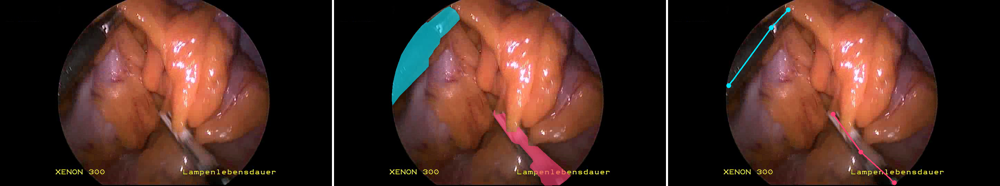

Pose-index assignment: `[50, 100]`.

## 05 — `Stage_3/Sigmoid/8/33000`

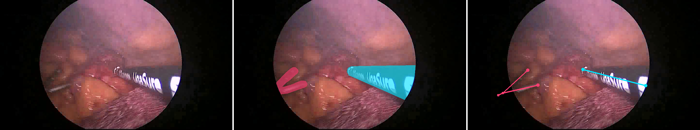

Pose-index assignment: `[50, 100]`.

## 06 — `Training/Rectal resection/8/239898`

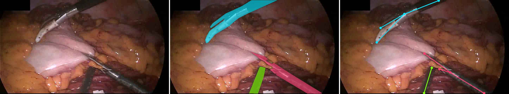

Pose-index assignment: `[50, 100, 150]`.

## 07 — `Training/Proctocolectomy/4/15123`

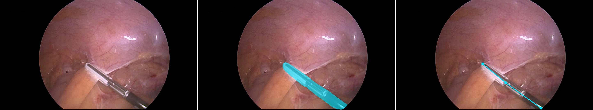

Pose-index assignment: `[50]`.

## 08 — `Training/Rectal resection/3/69000`

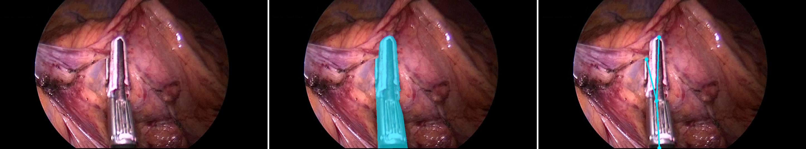

Pose-index assignment: `[50]`.

## 09 — `Training/Rectal resection/7/75000`

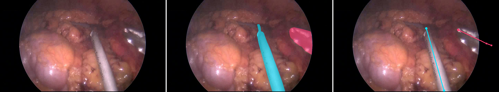

Pose-index assignment: `[50, 100]`.

## 10 — `Stage_3/Sigmoid/9/296202`

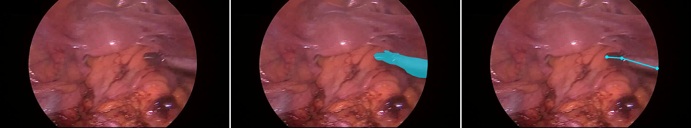

Pose-index assignment: `[50]`.

## 11 — `Training/Rectal resection/2/150000`

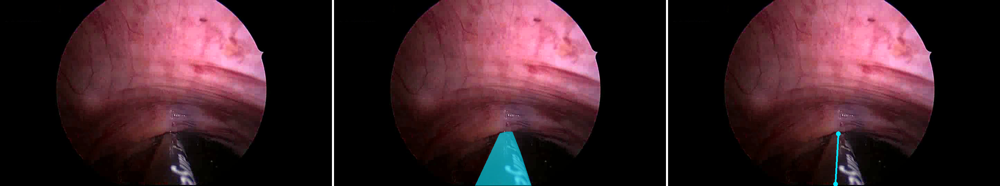

Pose-index assignment: `[50]`.

## 12 — `Stage_3/Sigmoid/10/149144`

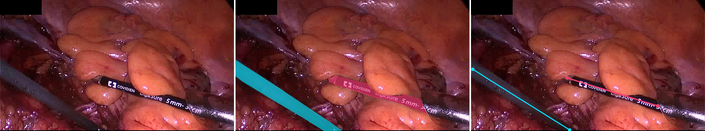

Pose-index assignment: `[50, 100]`.

## 13 — `Stage_3/Sigmoid/10/90176`

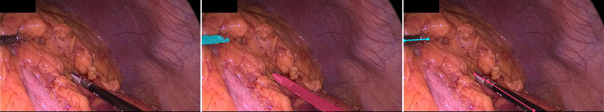

Pose-index assignment: `[100, 50]`.

## 14 — `Training/Rectal resection/10/23088`

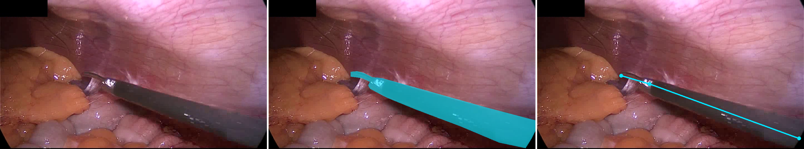

Pose-index assignment: `[50]`.

## 15 — `Training/Proctocolectomy/9/71696`

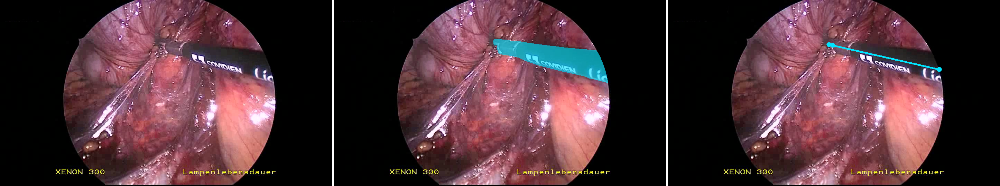

Pose-index assignment: `[50]`.

## 16 — `Stage_3/Sigmoid/3/107152`

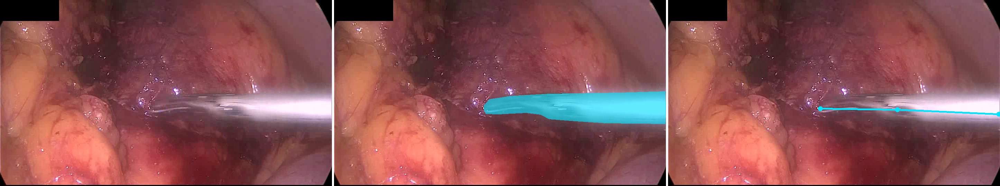

Pose-index assignment: `[50]`.

## 17 — `Stage_2/Proctocolectomy/6/177000`

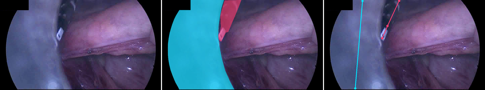

Pose-index assignment: `[50, 100]`.

## 18 — `Stage_2/Proctocolectomy/7/214500`

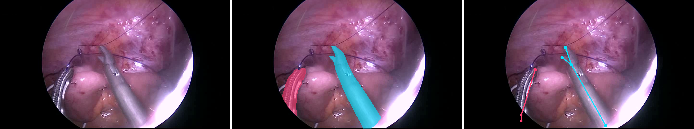

Pose-index assignment: `[50, 100]`.

## 19 — `Training/Proctocolectomy/10/31260`

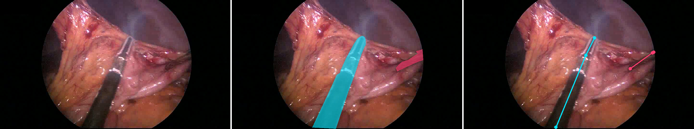

Pose-index assignment: `[50, 100]`.

## 20 — `Stage_1/Rectal resection/9/128287`

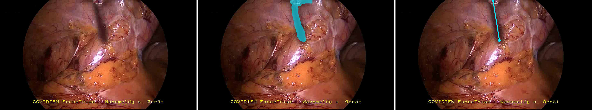

Pose-index assignment: `[50]`.
