# Bucket B matched examples

Panel order: **original | coloured instance masks | colour-matched poses**.

A pose and its assigned mask always share the same colour. Assignment maximizes one-to-one
skeleton coverage within a 20-pixel mask dilation.

## 01 — `Stage_3/Sigmoid/7/76500`

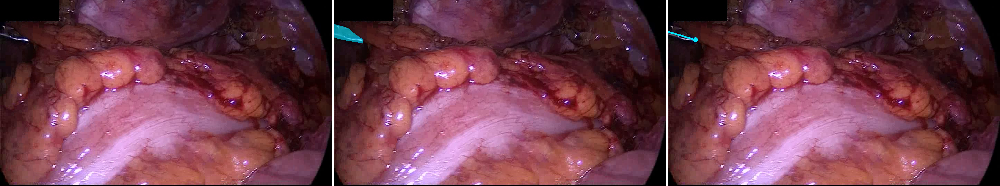

Pose-index assignment: `[50]`.

## 02 — `Stage_3/Sigmoid/9/13500`

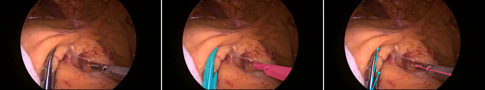

Pose-index assignment: `[50, 100]`.

## 03 — `Stage_3/Sigmoid/9/239221`

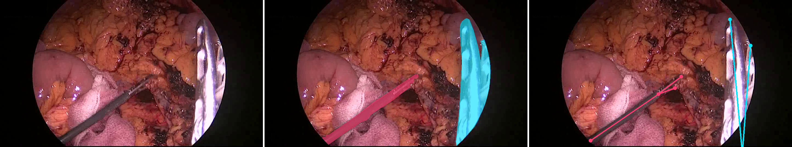

Pose-index assignment: `[100, 50]`.

## 04 — `Stage_2/Rectal resection/4/103579`

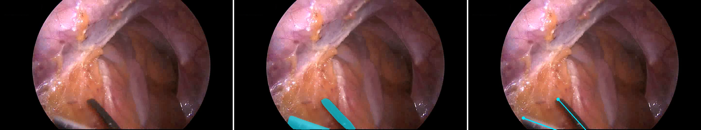

Pose-index assignment: `[50]`.

## 05 — `Training/Proctocolectomy/4/117123`

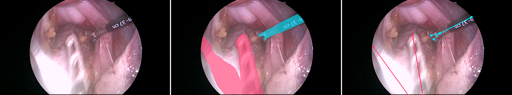

Pose-index assignment: `[50, 100]`.

## 06 — `Stage_3/Sigmoid/10/90276`

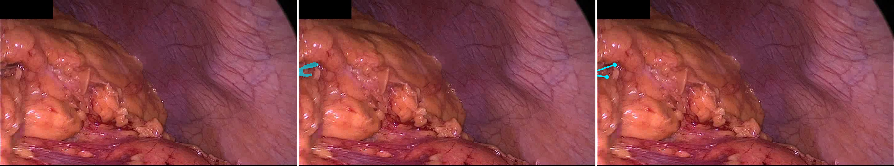

Pose-index assignment: `[50]`.

## 07 — `Stage_1/Proctocolectomy/10/80137`

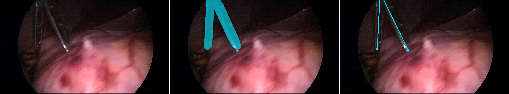

Pose-index assignment: `[50]`.

## 08 — `Training/Rectal resection/3/82500`

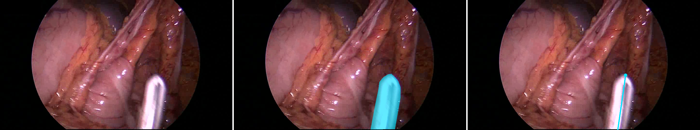

Pose-index assignment: `[50]`.

## 09 — `Stage_3/Sigmoid/3/46773`

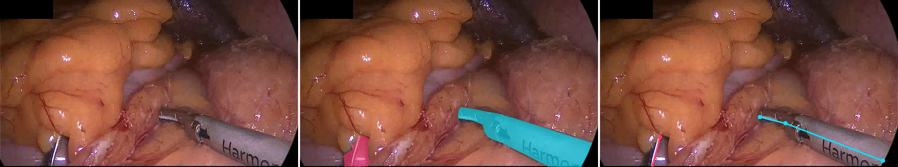

Pose-index assignment: `[100, 50]`.

## 10 — `Training/Rectal resection/2/281923`

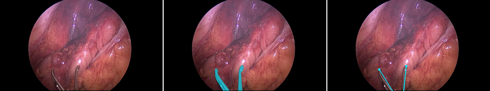

Pose-index assignment: `[50]`.

## 11 — `Training/Rectal resection/9/122353`

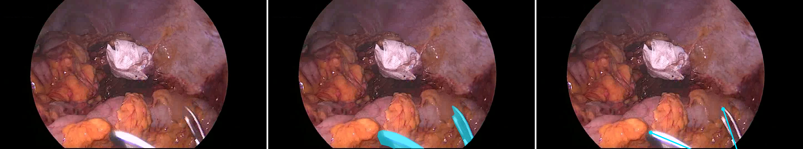

Pose-index assignment: `[50]`.

## 12 — `Stage_3/Sigmoid/10/168229`

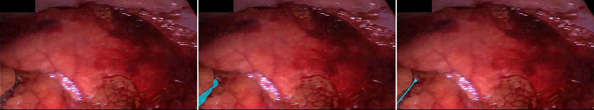

Pose-index assignment: `[50]`.

## 13 — `Training/Rectal resection/1/34500`

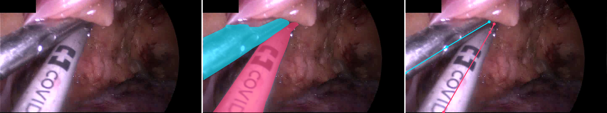

Pose-index assignment: `[50, 100]`.

## 14 — `Training/Rectal resection/9/301500`

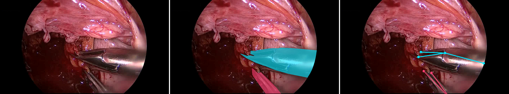

Pose-index assignment: `[50, 100]`.

## 15 — `Stage_3/Sigmoid/3/84652`

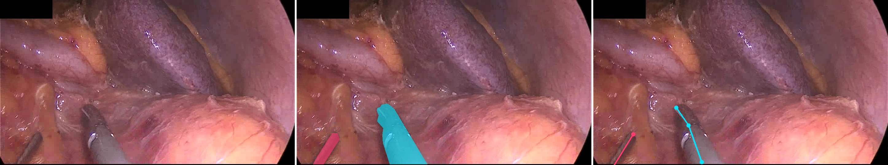

Pose-index assignment: `[100, 50]`.

## 16 — `Training/Rectal resection/10/35407`

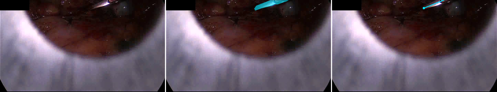

Pose-index assignment: `[50]`.

## 17 — `Stage_3/Sigmoid/9/267745`

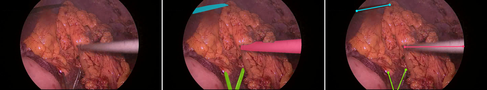

Pose-index assignment: `[50, 150, 100]`.

## 18 — `Stage_3/Sigmoid/3/95152`

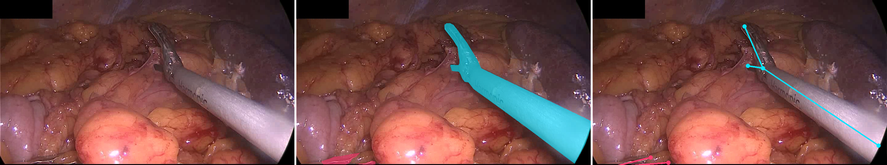

Pose-index assignment: `[50, 100]`.

## 19 — `Training/Proctocolectomy/10/63334`

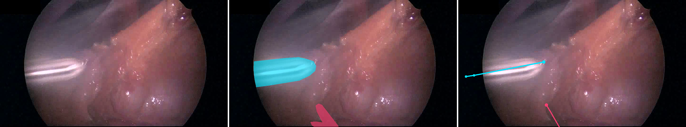

Pose-index assignment: `[50, 100]`.

## 20 — `Training/Rectal resection/9/16500`

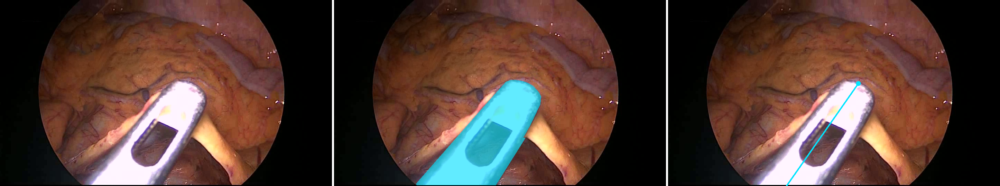

Pose-index assignment: `[50]`.
