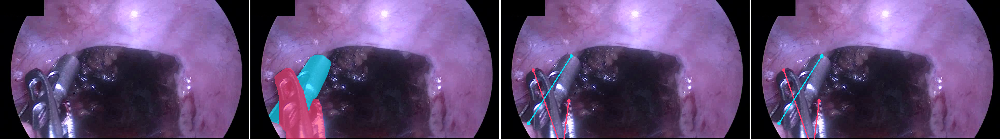
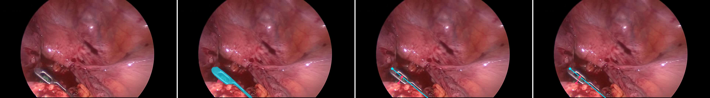
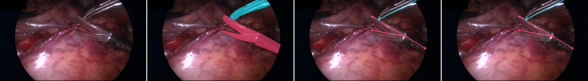
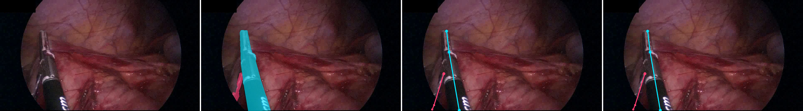
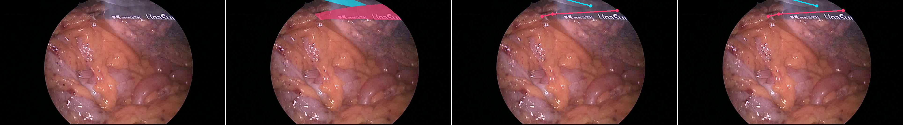
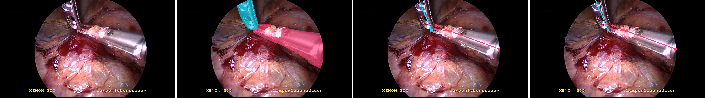

# Bucket C: explicit colour-matched review

Panel order: **original | masks | 20 px dilation matcher | manual review**.

Mask and skeleton colours now have one meaning: cyan = label 50; pink = label 100.
The third panel colours poses by the automatic assignment; the fourth uses your reviewed assignment.

## 01 — `Stage_2/Proctocolectomy/6/190500`

Automatic: `[100, 50]`; manual: `[100, 50]`.

## 02 — `Stage_3/Sigmoid/2/130935`

Automatic: `[50, 100]`; manual: `[50, 100]`.

## 03 — `Training/Proctocolectomy/10/119762`

Automatic: `[100, 50]`; manual: `[100, 50]`.

## 04 — `Training/Proctocolectomy/10/82147`

Automatic: `[50, 100]`; manual: `[50, 100]`.

## 05 — `Training/Proctocolectomy/4/51123`

Automatic: `[100, 50]`; manual: `[100, 50]`.

## 06 — `Training/Proctocolectomy/9/68741`

Automatic: `[50, 100]`; manual: `[50, 100]`.
