# SAM 1 ViT-H pilot gallery

Panel order: **raw + prompts | reference (cyan) | prediction (pink)**.
Positive prompts are green, negatives red, and boxes yellow.

## p1_visible_points

### worst 1: IoU 0.000

`Stage_3/Sigmoid/2/130935`, pose 1, bucket C

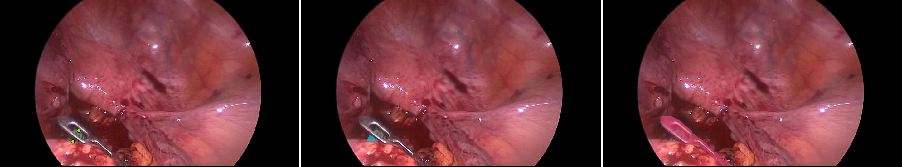

### worst 2: IoU 0.005

`Training/Rectal resection/2/269923`, pose 0, bucket B

### worst 3: IoU 0.005

`Stage_3/Sigmoid/9/284330`, pose 0, bucket B

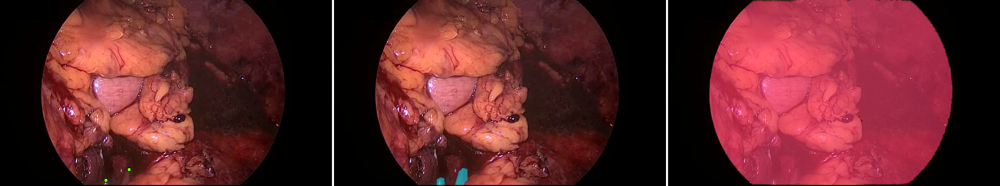

### best 4: IoU 0.960

`Stage_3/Sigmoid/9/48000`, pose 1, bucket A

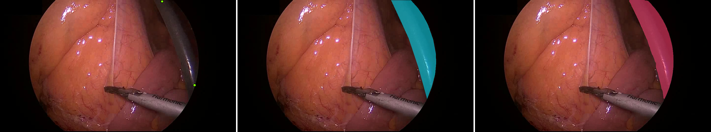

### best 5: IoU 0.961

`Stage_3/Sigmoid/9/49500`, pose 1, bucket A

### best 6: IoU 0.966

`Training/Rectal resection/6/39000`, pose 0, bucket A

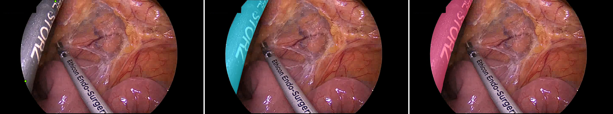

## p2_visible_skeleton

### worst 1: IoU 0.000

`Stage_3/Sigmoid/2/130935`, pose 1, bucket C

### worst 2: IoU 0.005

`Training/Rectal resection/2/269923`, pose 0, bucket B

### worst 3: IoU 0.005

`Stage_3/Sigmoid/9/284330`, pose 0, bucket B

### best 4: IoU 0.962

`Training/Rectal resection/9/265500`, pose 0, bucket A

### best 5: IoU 0.965

`Stage_3/Sigmoid/9/48000`, pose 1, bucket A

### best 6: IoU 0.966

`Training/Rectal resection/6/39000`, pose 0, bucket A

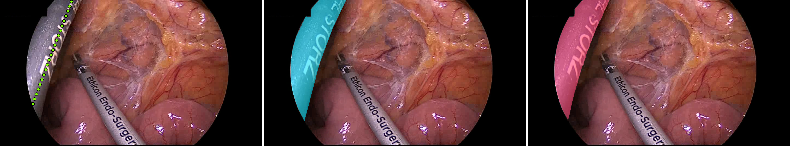

## p3_visible_box

### worst 1: IoU 0.000

`Stage_3/Sigmoid/2/130935`, pose 1, bucket C

### worst 2: IoU 0.000

`Stage_3/Sigmoid/7/168000`, pose 0, bucket B

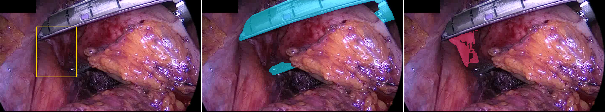

### worst 3: IoU 0.000

`Stage_3/Sigmoid/9/7026`, pose 1, bucket B

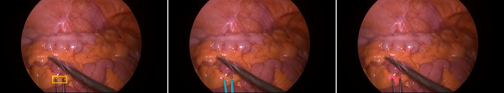

### best 4: IoU 0.961

`Stage_3/Sigmoid/9/48000`, pose 1, bucket A

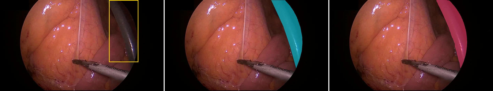

### best 5: IoU 0.961

`Stage_3/Sigmoid/9/49500`, pose 1, bucket A

### best 6: IoU 0.965

`Training/Rectal resection/6/39000`, pose 0, bucket A

## p4_visible_points_box

### worst 1: IoU 0.000

`Stage_3/Sigmoid/2/130935`, pose 1, bucket C

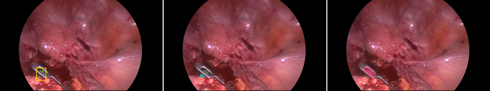

### worst 2: IoU 0.004

`Stage_3/Sigmoid/7/168000`, pose 0, bucket B

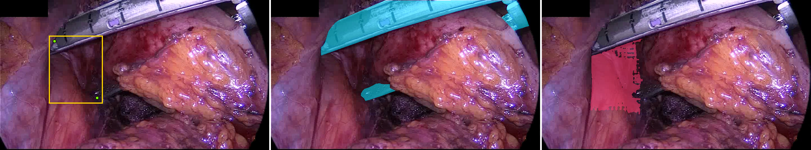

### worst 3: IoU 0.004

`Training/Proctocolectomy/9/26289`, pose 2, bucket B

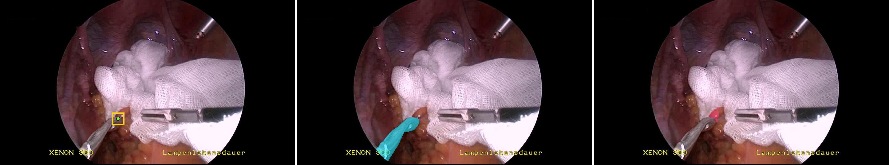

### best 4: IoU 0.962

`Stage_3/Sigmoid/9/49500`, pose 1, bucket A

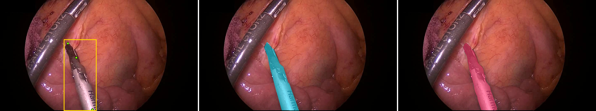

### best 5: IoU 0.963

`Stage_3/Sigmoid/9/48000`, pose 1, bucket A

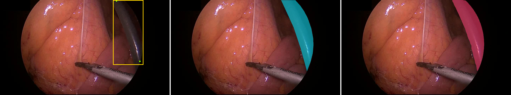

### best 6: IoU 0.965

`Training/Rectal resection/6/39000`, pose 0, bucket A

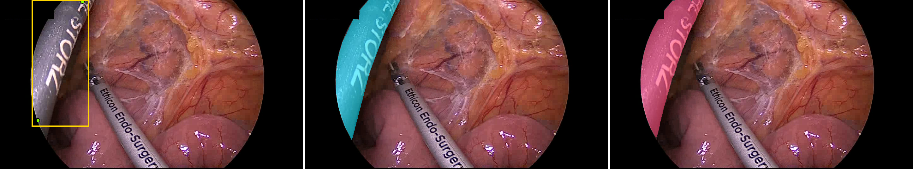

## p5_visible_points_negatives

### worst 1: IoU 0.001

`Stage_3/Sigmoid/2/130935`, pose 1, bucket C

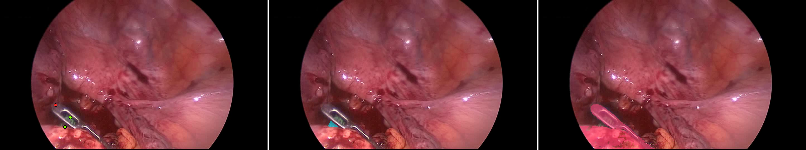

### worst 2: IoU 0.005

`Training/Rectal resection/2/269923`, pose 0, bucket B

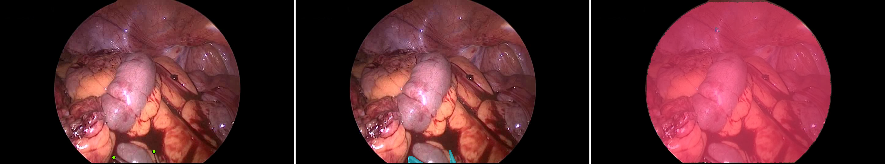

### worst 3: IoU 0.005

`Stage_3/Sigmoid/10/90401`, pose 1, bucket B

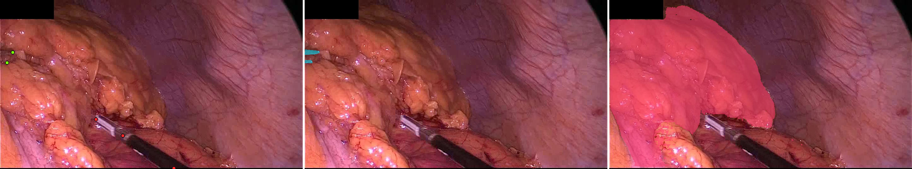

### best 4: IoU 0.959

`Training/Rectal resection/9/265500`, pose 0, bucket A

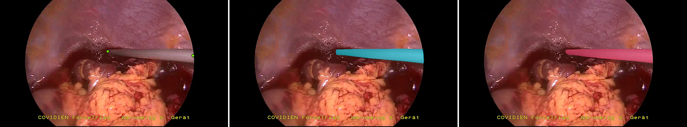

### best 5: IoU 0.960

`Stage_3/Sigmoid/9/48000`, pose 1, bucket A

### best 6: IoU 0.966

`Training/Rectal resection/6/39000`, pose 0, bucket A

## p6_visible_points_box_negatives

### worst 1: IoU 0.000

`Stage_3/Sigmoid/2/130935`, pose 1, bucket C

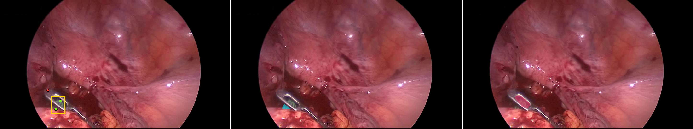

### worst 2: IoU 0.001

`Stage_3/Sigmoid/9/7026`, pose 1, bucket B

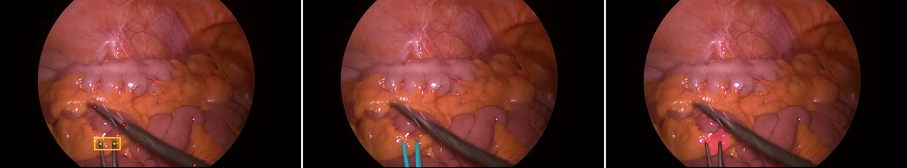

### worst 3: IoU 0.002

`Training/Rectal resection/10/97500`, pose 1, bucket B

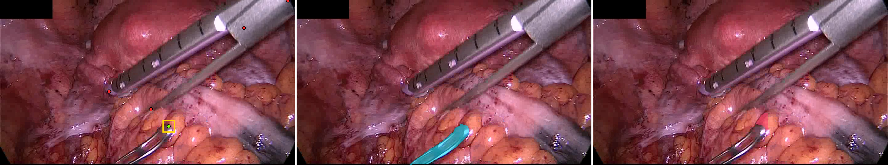

### best 4: IoU 0.958

`Stage_3/Sigmoid/9/396718`, pose 0, bucket A

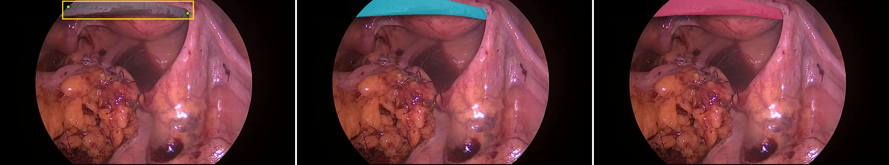

### best 5: IoU 0.961

`Stage_3/Sigmoid/9/48000`, pose 1, bucket A

### best 6: IoU 0.965

`Training/Rectal resection/6/39000`, pose 0, bucket A

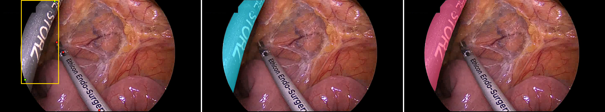

## p7_shifted_entry_ablation

### worst 1: IoU 0.000

`Training/Proctocolectomy/9/162000`, pose 0, bucket B

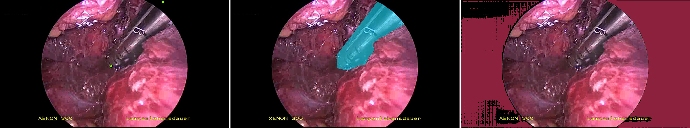

### worst 2: IoU 0.000

`Training/Proctocolectomy/9/26289`, pose 2, bucket B

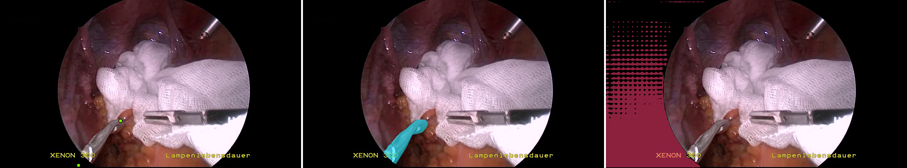

### worst 3: IoU 0.000

`Stage_2/Rectal resection/5/104132`, pose 1, bucket B

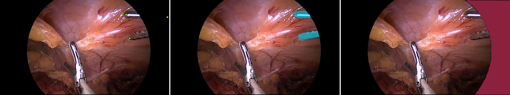

### best 4: IoU 0.960

`Stage_3/Sigmoid/9/48000`, pose 1, bucket A

### best 5: IoU 0.961

`Stage_3/Sigmoid/9/49500`, pose 1, bucket A

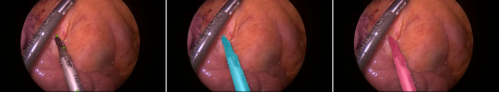

### best 6: IoU 0.966

`Training/Rectal resection/6/39000`, pose 0, bucket A

