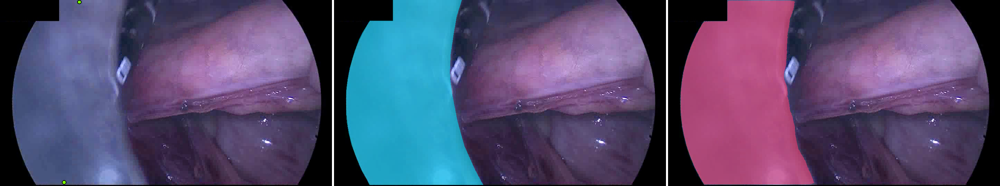
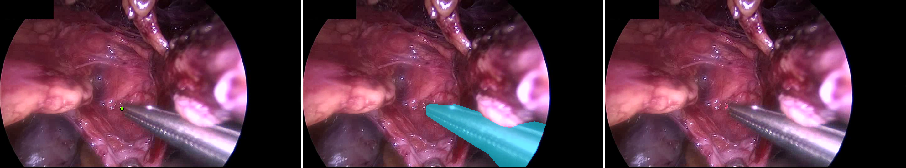
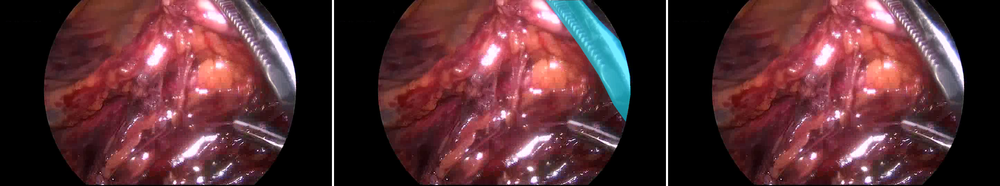
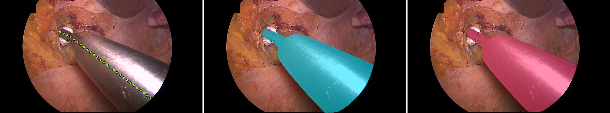
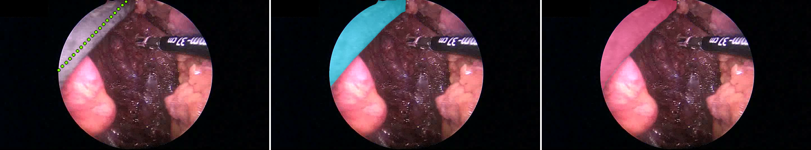
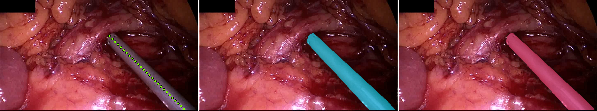

# SAM 1 ViT-H pilot gallery

Panel order: **raw + prompts | reference (cyan) | prediction (pink)**.
Positive prompts are green, negatives red, and boxes yellow.

## p1_visible_points

### worst 1: IoU 0.000

`Stage_1/Proctocolectomy/10/119662`, pose 1, bucket B

### worst 2: IoU 0.000

`Stage_1/Rectal resection/1/361906`, pose 0, bucket B

### worst 3: IoU 0.000

`Stage_2/Rectal resection/4/61579`, pose 1, bucket B

### best 4: IoU 0.976

`Training/Rectal resection/9/58500`, pose 0, bucket A

### best 5: IoU 0.977

`Stage_2/Proctocolectomy/6/177000`, pose 0, bucket A

### best 6: IoU 0.977

`Stage_3/Sigmoid/10/27000`, pose 0, bucket A

## p2_visible_skeleton

### worst 1: IoU 0.000

`Stage_1/Proctocolectomy/10/119662`, pose 1, bucket B

### worst 2: IoU 0.000

`Stage_1/Rectal resection/1/361906`, pose 0, bucket B

### worst 3: IoU 0.000

`Stage_2/Rectal resection/4/61579`, pose 1, bucket B

### best 4: IoU 0.974

`Training/Rectal resection/9/58500`, pose 0, bucket A

### best 5: IoU 0.974

`Training/Proctocolectomy/10/285000`, pose 1, bucket A

### best 6: IoU 0.977

`Stage_3/Sigmoid/10/27000`, pose 0, bucket A

