# SAM 1 ViT-H gallery by reporting bucket

Panel order: **raw + prompts | reference (cyan) | prediction (pink)**.
Positive prompts are green, negatives red, and boxes yellow.

## p1_visible_points — Bucket A

### worst 1: IoU 0.004 (failure)

`Training/Proctocolectomy/10/34379`, pose 1, bucket A

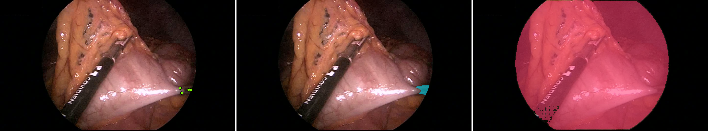

### worst 2: IoU 0.005 (failure)

`Training/Proctocolectomy/10/34354`, pose 1, bucket A

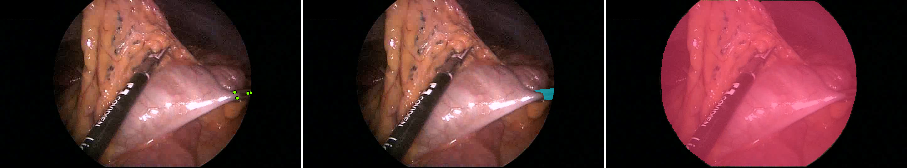

### worst 3: IoU 0.006 (failure)

`Training/Proctocolectomy/10/34629`, pose 1, bucket A

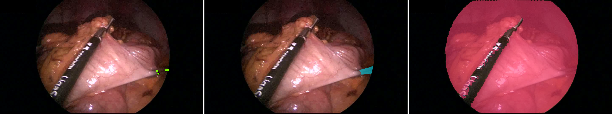

### best 1: IoU 0.971 (success)

`Training/Proctocolectomy/9/88856`, pose 0, bucket A

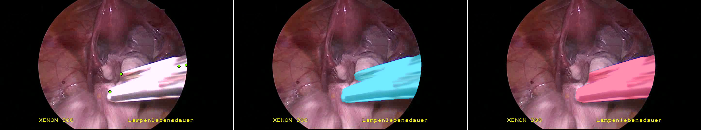

### best 2: IoU 0.972 (success)

`Stage_3/Sigmoid/7/165000`, pose 0, bucket A

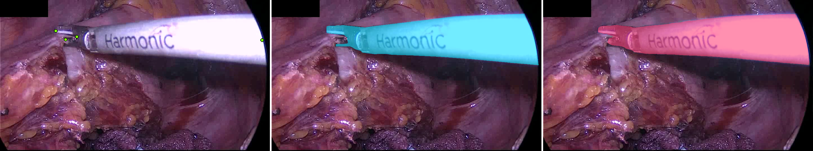

### best 3: IoU 0.973 (success)

`Training/Proctocolectomy/9/88106`, pose 1, bucket A

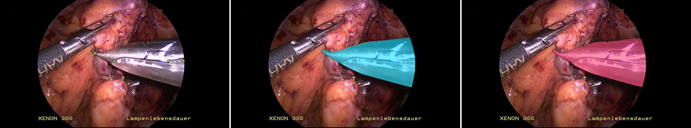

## p1_visible_points — Bucket B

### worst 1: IoU 0.000 (failure)

`Stage_1/Rectal resection/1/361906`, pose 0, bucket B

### worst 2: IoU 0.001 (failure)

`Training/Proctocolectomy/9/279000`, pose 2, bucket B

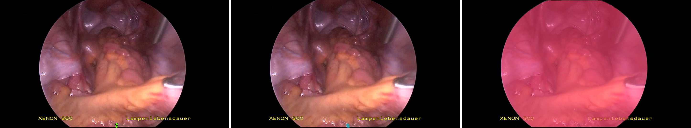

### worst 3: IoU 0.001 (failure)

`Stage_3/Sigmoid/9/253045`, pose 1, bucket B

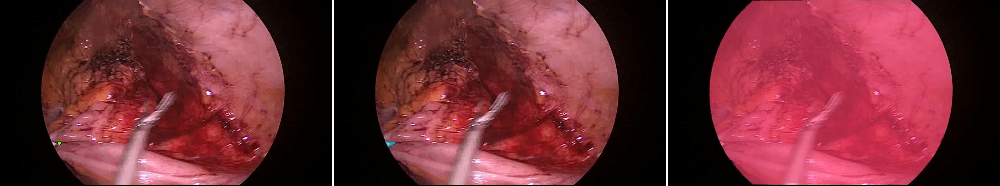

### best 1: IoU 0.976 (success)

`Training/Rectal resection/9/58500`, pose 0, bucket B

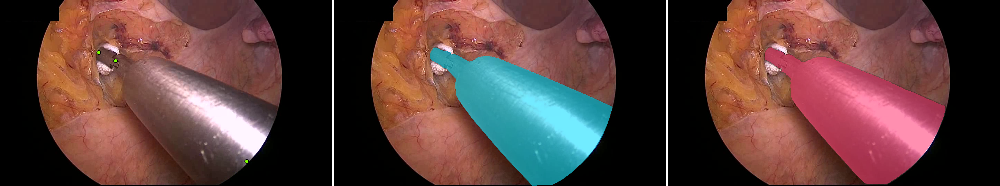

### best 2: IoU 0.977 (success)

`Stage_2/Proctocolectomy/6/177000`, pose 0, bucket B

### best 3: IoU 0.977 (success)

`Stage_3/Sigmoid/10/27000`, pose 0, bucket B

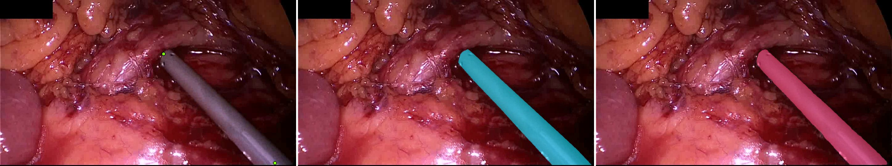

## p1_visible_points — Bucket C

### worst 1: IoU 0.000 (failure)

`Stage_1/Proctocolectomy/10/119662`, pose 1, bucket C

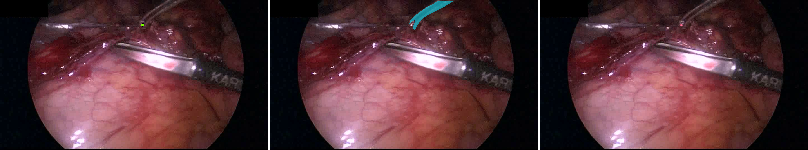

### worst 2: IoU 0.000 (failure)

`Stage_2/Rectal resection/4/61579`, pose 1, bucket C

### worst 3: IoU 0.000 (failure)

`Stage_3/Sigmoid/10/90326`, pose 0, bucket C

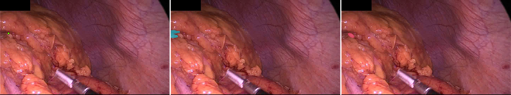

### best 1: IoU 0.969 (success)

`Training/Rectal resection/10/43107`, pose 0, bucket C

### best 2: IoU 0.970 (success)

`Training/Proctocolectomy/3/99665`, pose 1, bucket C

### best 3: IoU 0.973 (success)

`Stage_3/Sigmoid/10/17910`, pose 0, bucket C

## p1_visible_points — Bucket D

### worst 1: IoU 0.000 (failure)

`Stage_3/Sigmoid/2/130935`, pose 1, bucket D

### worst 2: IoU 0.009 (failure)

`Training/Proctocolectomy/4/51123`, pose 1, bucket D

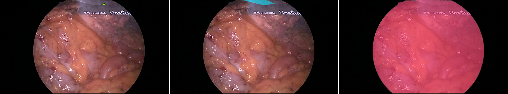

### worst 3: IoU 0.059 (failure)

`Training/Proctocolectomy/4/51123`, pose 0, bucket D

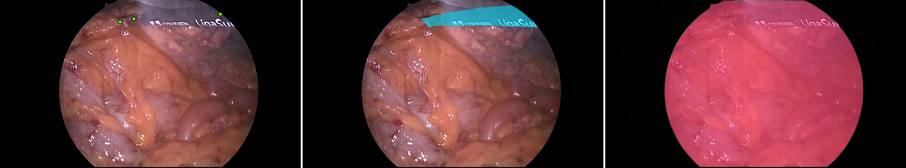

### best 1: IoU 0.846 (success)

`Training/Proctocolectomy/10/82147`, pose 0, bucket D

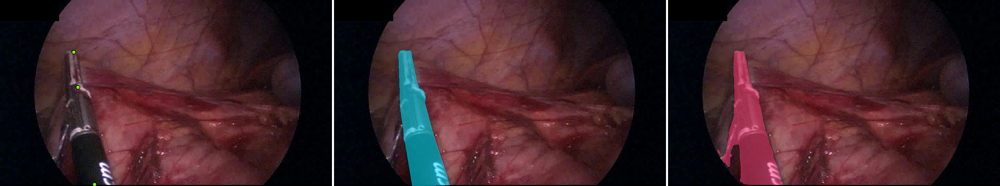

### best 2: IoU 0.862 (success)

`Stage_3/Sigmoid/2/130935`, pose 0, bucket D

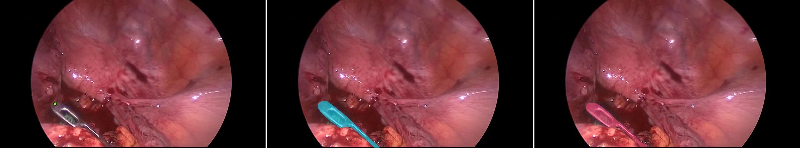

### best 3: IoU 0.942 (success)

`Training/Proctocolectomy/9/68741`, pose 0, bucket D

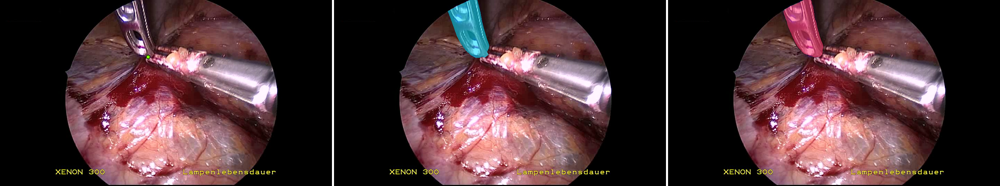

## p2_visible_skeleton — Bucket A

### worst 1: IoU 0.002 (failure)

`Stage_2/Rectal resection/5/17079`, pose 0, bucket A

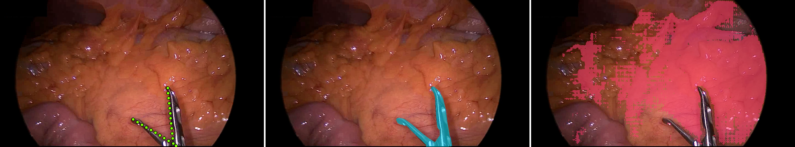

### worst 2: IoU 0.005 (failure)

`Training/Proctocolectomy/10/34379`, pose 1, bucket A

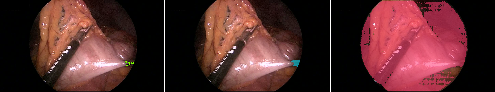

### worst 3: IoU 0.005 (failure)

`Training/Proctocolectomy/10/34354`, pose 1, bucket A

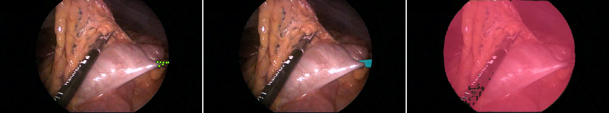

### best 1: IoU 0.966 (success)

`Stage_2/Rectal resection/5/99632`, pose 0, bucket A

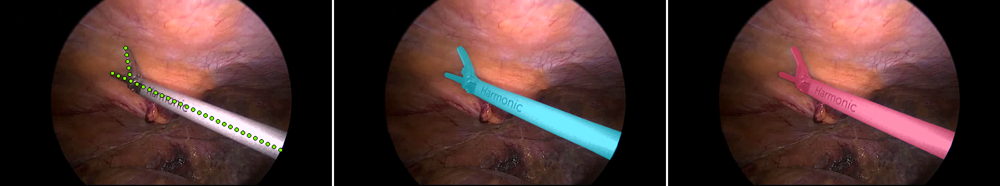

### best 2: IoU 0.967 (success)

`Stage_3/Sigmoid/9/153000`, pose 0, bucket A

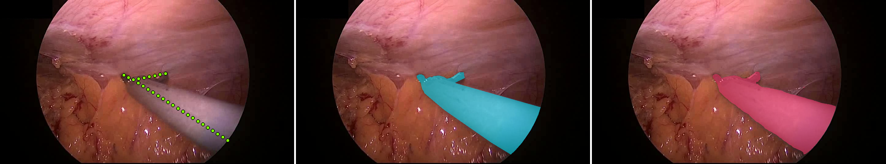

### best 3: IoU 0.968 (success)

`Training/Rectal resection/6/406500`, pose 1, bucket A

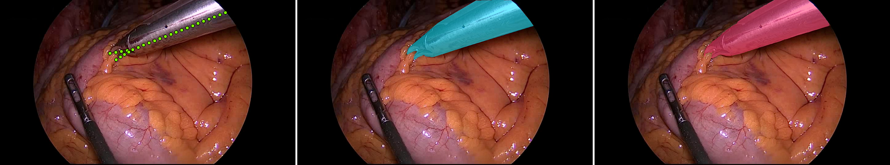

## p2_visible_skeleton — Bucket B

### worst 1: IoU 0.000 (failure)

`Stage_1/Rectal resection/1/361906`, pose 0, bucket B

### worst 2: IoU 0.000 (failure)

`Stage_3/Sigmoid/9/101723`, pose 1, bucket B

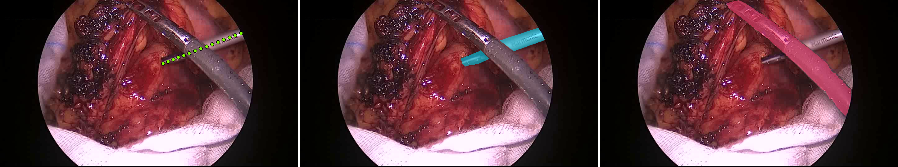

### worst 3: IoU 0.001 (failure)

`Training/Rectal resection/10/42482`, pose 1, bucket B

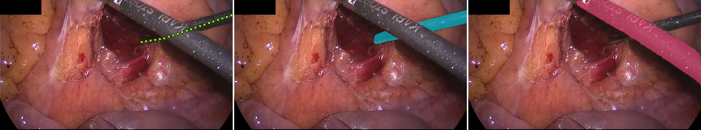

### best 1: IoU 0.974 (success)

`Training/Rectal resection/9/58500`, pose 0, bucket B

### best 2: IoU 0.974 (success)

`Training/Proctocolectomy/10/285000`, pose 1, bucket B

### best 3: IoU 0.977 (success)

`Stage_3/Sigmoid/10/27000`, pose 0, bucket B

## p2_visible_skeleton — Bucket C

### worst 1: IoU 0.000 (failure)

`Stage_1/Proctocolectomy/10/119662`, pose 1, bucket C

### worst 2: IoU 0.000 (failure)

`Stage_2/Rectal resection/4/61579`, pose 1, bucket C

### worst 3: IoU 0.000 (failure)

`Stage_3/Sigmoid/10/90326`, pose 0, bucket C

### best 1: IoU 0.969 (success)

`Training/Rectal resection/10/43107`, pose 0, bucket C

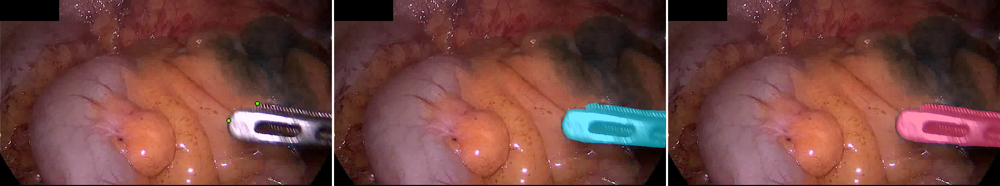

### best 2: IoU 0.970 (success)

`Training/Proctocolectomy/3/99665`, pose 1, bucket C

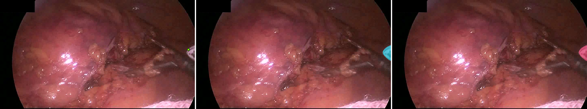

### best 3: IoU 0.973 (success)

`Stage_3/Sigmoid/10/17910`, pose 0, bucket C

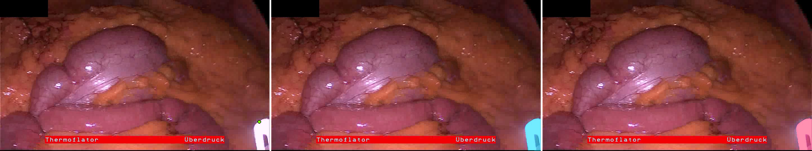

## p2_visible_skeleton — Bucket D

### worst 1: IoU 0.000 (failure)

`Stage_3/Sigmoid/2/130935`, pose 1, bucket D

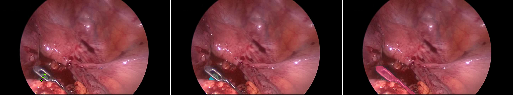

### worst 2: IoU 0.009 (failure)

`Training/Proctocolectomy/4/51123`, pose 1, bucket D

### worst 3: IoU 0.063 (failure)

`Training/Proctocolectomy/4/51123`, pose 0, bucket D

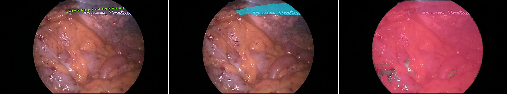

### best 1: IoU 0.862 (success)

`Stage_3/Sigmoid/2/130935`, pose 0, bucket D

### best 2: IoU 0.889 (success)

`Training/Proctocolectomy/10/82147`, pose 0, bucket D

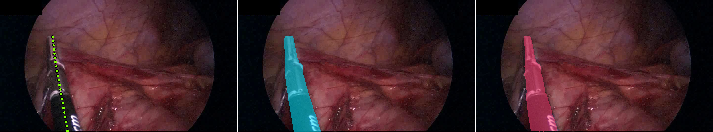

### best 3: IoU 0.942 (success)

`Training/Proctocolectomy/9/68741`, pose 0, bucket D

