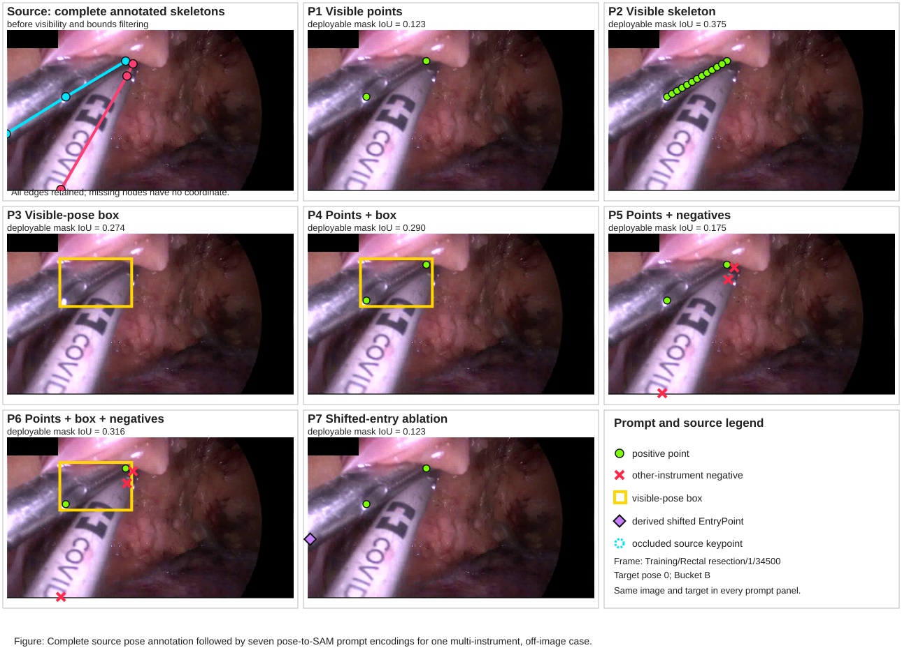

# Manuscript prompt-strategy example

The first panel shows the complete unfiltered source skeleton annotations. All seven prompt panels use the same target pose from `Training/Rectal resection/1/34500`. Green circles are positive prompts, red crosses are competing-instrument negatives, yellow is the visible-pose box, and the purple diamond is the derived shifted EntryPoint.

